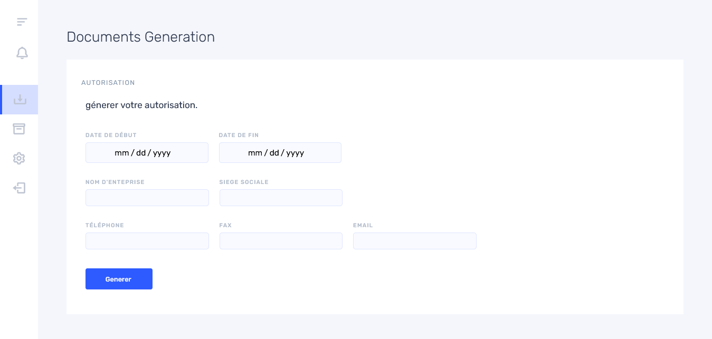
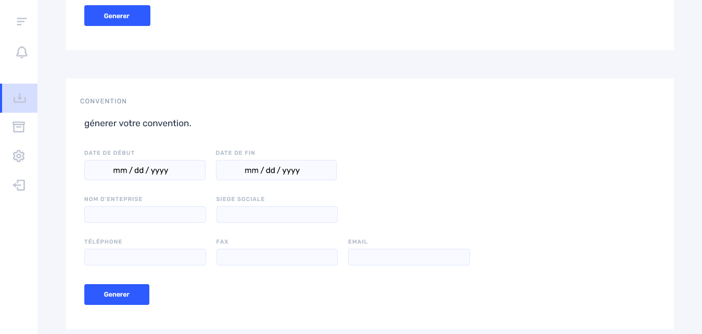
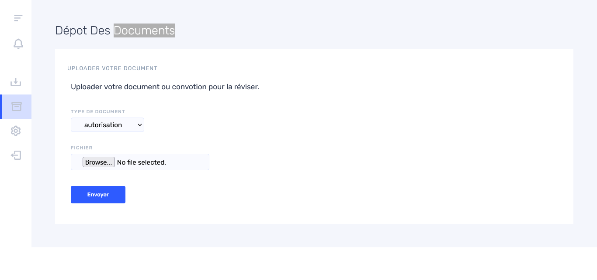
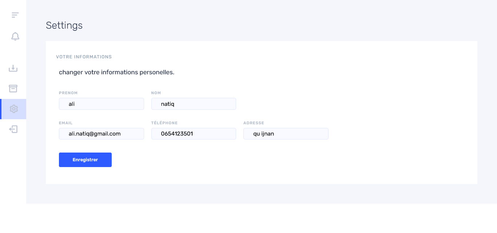
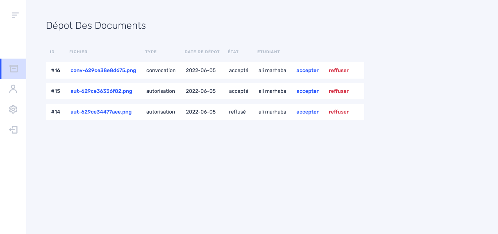
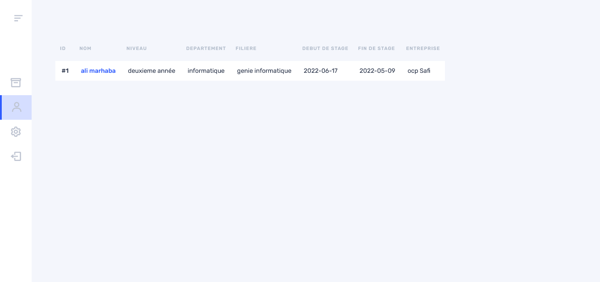
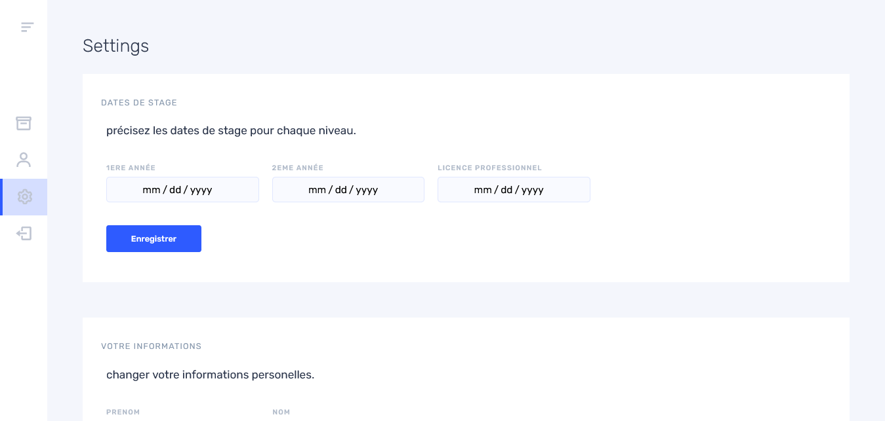
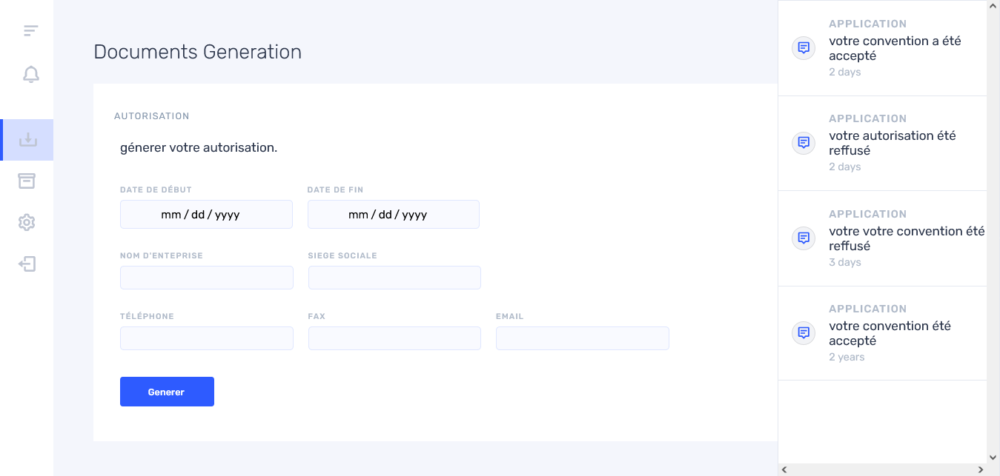

# Web Application

The project developed is a platform that facilitates the management of
internship documents. It allows:

- Students: to generate their documents automatically filled in, to be
  notified of administrators' decisions.
- Administrators: to accept or reject the documents submitted by
  students, to define the internship dates interval, and to view the
  students with their internship information.

## Web Pages

### Student Section

#### Login Page

The user enters the username and password, if they correspond to a field
in the student table, they are redirected to the document generation
page. If they correspond to a field in the administrator table, they are
redirected to the document submission page for administrators.
Otherwise, an error message is displayed.

#### Document Generation

The student can download the assessment form and generate the
authorization or agreement by entering the internship company
information and start and end dates if they are in their first year. The
agreement and authorization in Word are filled in by the student's
information from the database and the information entered using PHP
Word, then converted to PDF using OpenOffice and finally downloaded.

#### Document Submission

The student can upload their scanned documents to the administrators for
review after signing them.

#### Settings

This page allows the student to change their personal information.

### Administrator Section

#### Document Submission

List of documents uploaded by students for acceptance or rejection.

#### Students

List of students and their internship information.

#### Settings

This page allows the administrator to define the internship dates for
students and change their personal information.

### Other Features

#### Notifications

The student is notified once their documents are accepted or rejected.
Notifications are retrieved using AJAX, once the student clicks on the
icon, notifications are updated without refreshing the entire page.

#### Student Submission

By clicking on a student on the Student page, the documents they have
uploaded (Document Submission page) are displayed.

